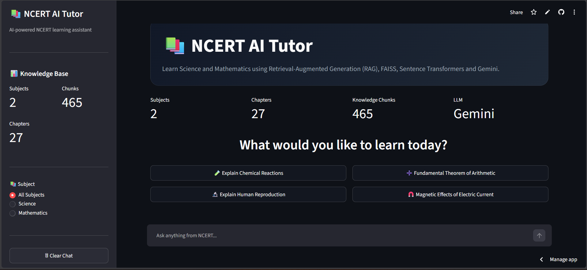
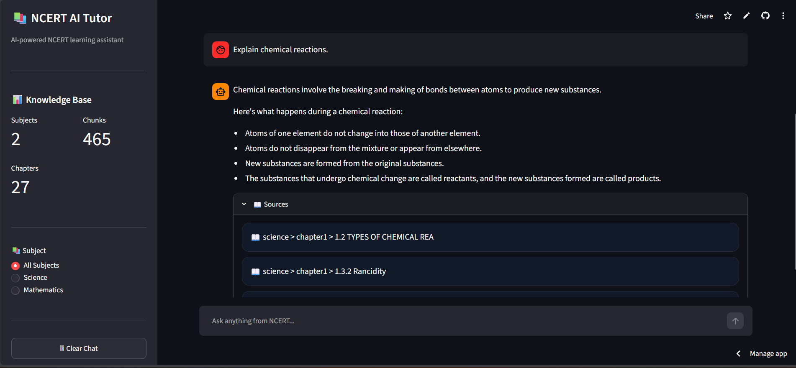

# NCERT RAG Chatbot

An AI-powered Retrieval-Augmented Generation (RAG) chatbot built using FAISS, Sentence Transformers, Streamlit, and Google's Gemini API.

The system answers questions from NCERT Class 10 Science and Mathematics textbooks by retrieving relevant textbook content through semantic search and generating grounded responses based strictly on NCERT material.

🚀 Try the application here:

**https://ncert-rag-chatbot-deviantecho.streamlit.app/**



---

## Key Highlights

* End-to-End RAG Pipeline
* Semantic Search using FAISS
* Gemini 2.5 Flash Integration
* Multi-Turn Conversational Memory
* History-Aware Query Rewriting
* Source Attribution
* Streamlit Web Interface
* NCERT Science & Mathematics Knowledge Base

---

# Demo

## Chat Interface

Users can ask questions naturally and receive answers grounded in NCERT textbook content.



---

## Retrieval Pipeline

The system retrieves the most relevant textbook chunks using semantic similarity search before generating an answer.


---

# Features

### Knowledge Base Creation

* PDF Text Extraction
* OCR Cleaning & Normalization
* Section-Aware Chunking
* Embedding Generation
* FAISS Index Creation

### Retrieval

* Semantic Search
* Cosine Similarity Retrieval
* Subject Filtering
* Top-K Context Retrieval

### Conversational AI

* Multi-Turn Conversations
* Query Rewriting for Follow-Up Questions
* Context-Aware Responses
* Source Attribution

### User Interface

* Streamlit Dashboard
* Chat-Based Interaction
* Retrieval Transparency
* Source Display

---

# System Architecture

```text
NCERT PDFs
      │
      ▼
PDF Text Extraction
      │
      ▼
OCR Cleaning & Normalization
      │
      ▼
Section-Aware Chunking
      │
      ▼
Sentence Embeddings
      │
      ▼
FAISS Vector Database
      │
      ▼
Semantic Retrieval
      │
      ▼
Conversation-Aware Query Rewriting
      │
      ▼
Context Construction
      │
      ▼
Gemini 2.5 Flash
      │
      ▼
Grounded Answer + Sources
```

---

# Tech Stack

## Artificial Intelligence

* Google Gemini 2.5 Flash
* Sentence Transformers
* Retrieval-Augmented Generation (RAG)

## Vector Search

* FAISS
* Cosine Similarity Search

## Frontend

* Streamlit

## Backend

* Python

## Data Processing

* JSON
* Regular Expressions
* NumPy

## Machine Learning Libraries

* Sentence Transformers
* Transformers
* PyTorch

---

# Knowledge Base Statistics

| Metric              | Value            |
| ------------------- | ---------------- |
| Subjects            | 2                |
| Chapters Indexed    | 28               |
| Total Chunks        | 785              |
| Embedding Model     | all-MiniLM-L6-v2 |
| Embedding Dimension | 384              |
| Vector Database     | FAISS            |
| LLM                 | Gemini 2.5 Flash |

---

# Dataset

## NCERT Class 10 Mathematics

* Real Numbers
* Polynomials
* Pair of Linear Equations in Two Variables
* Quadratic Equations
* Arithmetic Progressions
* Triangles
* Coordinate Geometry
* Introduction to Trigonometry
* Some Applications of Trigonometry
* Circles
* Constructions
* Areas Related to Circles
* Surface Areas and Volumes
* Statistics
* Probability

## NCERT Class 10 Science

* Chemical Reactions and Equations
* Acids, Bases and Salts
* Metals and Non-metals
* Carbon and Its Compounds
* Periodic Classification of Elements
* Life Processes
* How Do Organisms Reproduce?
* Heredity
* Light: Reflection and Refraction
* The Human Eye and the Colourful World
* Electricity
* Magnetic Effects of Electric Current
* Our Environment

---

# RAG Features

## Semantic Retrieval

Questions are converted into vector embeddings and matched against textbook content using FAISS.

## Query Rewriting

Follow-up questions are automatically rewritten into standalone questions using Gemini before retrieval.

## Context Grounding

Only retrieved NCERT content is supplied to the LLM, reducing hallucinations and improving factual accuracy.

## Source Attribution

Responses include chapter and section information used during answer generation.

## Multi-Turn Conversations

The chatbot maintains conversation history to support contextual follow-up questions.

---

# Project Structure

```text
ncert-rag-chatbot/

├── data/
│   ├── pdfs/
│   ├── text/
│   ├── clean_text/
│   ├── chunks/
│   ├── embeddings/
│   ├── faiss_index.bin
│   └── chunk_metadata.json
│
├── images/
│   ├── homepage.png
│   ├── chat-example.png
│   └── retrieval-example.png
│
├── scripts/
│   ├── extract_text.py
│   ├── clean_text.py
│   ├── chunk_text.py
│   ├── generate_embeddings.py
│   ├── build_faiss_index.py
│   └── search_faiss.py
│
├── app.py
├── rag_engine.py
├── requirements.txt
├── .env
└── README.md
```

---

# Installation

## Clone Repository

```bash
git clone https://github.com/deviantecho/ncert-rag-chatbot.git
cd ncert-rag-chatbot
```

## Create Virtual Environment

```bash
python -m venv venv
```

### Windows

```bash
venv\Scripts\activate
```

### Mac/Linux

```bash
source venv/bin/activate
```

## Install Dependencies

```bash
pip install -r requirements.txt
```

---

# Environment Variables

Create a `.env` file in the root directory:

```env
GEMINI_API_KEY=your_api_key_here
```

---

# Build the Knowledge Base

## 1. Extract Text from PDFs

```bash
python scripts/extract_text.py
```

## 2. Clean and Normalize Text

```bash
python scripts/clean_text.py
```

## 3. Create Chunks

```bash
python scripts/chunk_text.py
```

## 4. Generate Embeddings

```bash
python scripts/generate_embeddings.py
```

## 5. Build FAISS Index

```bash
python scripts/build_faiss_index.py
```

---

# Test Retrieval

```bash
python scripts/search_faiss.py
```

---

# Run the Application

```bash
streamlit run app.py
```

---

# Example

## Question

**What is a balanced chemical equation?**

## Retrieved Source

Science → Chemical Reactions and Equations → Balanced Chemical Equations

## Answer

A chemical equation is balanced when the number of atoms of each element is equal on both sides of the equation. This satisfies the law of conservation of mass because matter is neither created nor destroyed during a chemical reaction.

---

# Future Improvements

* Hybrid Search (BM25 + Vector Search)
* Cross-Encoder Reranking
* Additional NCERT Classes
* Additional Subjects
* Citation Highlighting
* PDF Source Linking
* Docker Support
* Cloud Deployment
* User Authentication
* Analytics Dashboard

---

# Learning Outcomes

This project demonstrates practical implementation of:

* Retrieval-Augmented Generation (RAG)
* Semantic Search
* Vector Databases
* Embedding Models
* Information Retrieval
* Prompt Engineering
* Conversational AI
* End-to-End AI Application Development

---

# Author

## Devesh Kumar Singh

Computer Science Engineering Student

### Interests

* Artificial Intelligence
* Retrieval-Augmented Generation (RAG)
* Machine Learning
* Natural Language Processing
* Software Development

### Connect

* GitHub: https://github.com/deviantecho
* LinkedIn: https://www.linkedin.com/in/deviantecho
